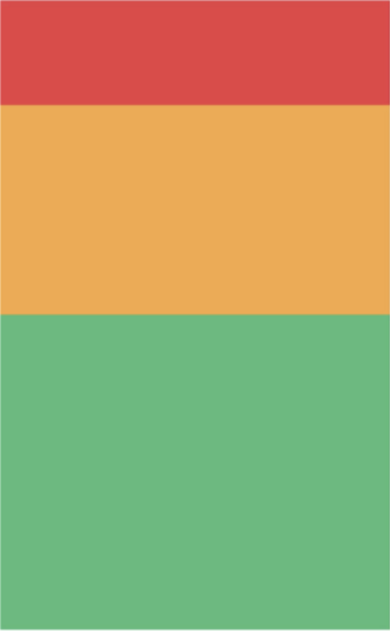
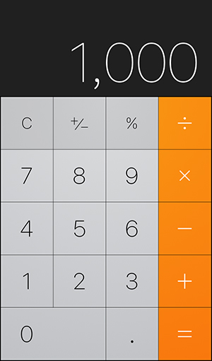

# React Nativeでのデザインの考え方

React NativeのUI構築において、基本となるのがFlexboxです。
すでに、CSSでも使っていると思いますが、同様の仕組みがReact Nativeにもあります。
公式でも推奨とされているので、Flexboxを使っていきましょう。

## Flexboxの基本

CSSでは、`display: flex;`と定義していたかと思いますが、React Nativeでは`flex: 1`と定義します。

CSSと同様の仕組みが用意されているので`flex-direction`や`justify-content`、`align-items`などのプロパティがあるが、大きな違いとして`キャメルケース`で記載する必要があります。後ほどStyleSheetの記載方法で詳しくやろうと思います。


### flexDirection
ここら辺は問題ないでしょう

### justifyContent
ここら辺は問題ないでしょう

### alignItems
ここら辺は問題ないでしょう

## Styleの適用方法
`StyleSheet.create`を使って定義します。

```jsx
import { StyleSheet } from 'react-native'

const styles = StyleSheet.create({
  container: {
    flex: 1
  },
})
```

定義したstyleを下記のようにしてコンポーネントに割り当てます。
```jsx
<View style={styles.container}></View>
```

また、配列を用いることで、複数のstyleを合成して割り当てることもできます。  
同一の項目がある場合は、配列の後ろの要素の方が優先されます。

```jsx
const styles = StyleSheet.create({
  style1: {
    marginTop: 20,
    backgroundColor: 'red'
  },
  style2: {
    marginBottom: 30,
    backgroundColor: 'blue'
  }
})
```

```jsx
<View style={[styles.style1, styles.style2]}></View>
```
上記の例の場合、下記のstyleが割り当てられます。
```jsx
{
  marginTop: 20,
  marginBottom: 30,
  backgroundColor: 'blue'
}
```

## 実際にUIを構築していこう

以下演習では各演習用のJSファイル（例えば`lesson1.js`）を作成してください。 

各演習用のサンプルコード
```jsx
import React from 'react';
import { StyleSheet, Text, View } from 'react-native';

const Lesson1 = () => {
  return (
    <View style={styles.body}>
      <View style={styles.item}>
        <Text>1</Text>
      </View>
      <View style={styles.item}>
        <Text>2</Text>
      </View>
      <View style={styles.item}>
        <Text>3</Text>
      </View>
    </View>
  );
};

const styles = StyleSheet.create({
  body: {
    flex: 1,
  },
  item: {
    height: 30,
    width: 30,
    backgroundColor: '#bec6cc',
  }
});

export default Lesson1;
```

作成したJSファイルを`App.js`にインポートして、反映してください。

```jsx
import Lesson1 from './lesson1';

const App = () => {
  return (
    <Lesson1 />
  );
};
```


### 演習1:横並びにするためにStyleSheetを作ってください。
```jsx
<View>
  <View>
    <Text>1</Text>
  </View>
  <View>
    <Text>2</Text>
  </View>
  <View>
    <Text>3</Text>
  </View>
</View>
```

### 演習2:逆順に表示するためにStyleSheetを作ってください。（JSXは演習1と同様）

### 演習3:等間隔で余白を開けて、縦並びするためにStyleSheetを作ってください。（JSXは演習1と同様）

### 演習4:画面中央に要素を配置するためにStyleSheetを作ってください。
```jsx
<View>
  <View>
    <Text>center</Text>
  </View>
</View>
```
### 演習6:下の画像のようなレイアウトを構築してください。上から高さが1:2:3となっています。（JSXは演習1と同様）




### 演習6:下の画像のようなレイアウトを構築してください。機能の実装はしなくて良いです。




---
## 以下関連リンク

<!-- ## 主要のコンポーネント・API -->

### StyleSheet
[ドキュメント](https://reactnative.dev/docs/stylesheet)  
[Style定義](https://reactnative.dev/docs/style)

### View
[ドキュメント](https://reactnative.dev/docs/view)  
[Flexboxレイアウト](https://reactnative.dev/docs/flexbox)

### Text
[ドキュメント](https://reactnative.dev/docs/text)

<!-- 
### Image
[ドキュメント](https://reactnative.dev/docs/image)  
[画像データ周り](https://reactnative.dev/docs/images)

### TextInput
[ドキュメント](https://reactnative.dev/docs/textinput)

### ScrollView
[ドキュメント](https://reactnative.dev/docs/scrollview) -->

<!-- 
## その他

### FlatList
リストデータ用のコンポーネント  
画面で表示される部分のみレンダリングするので、多量のリストデータを表示するときに向いている  
[ドキュメント](https://reactnative.dev/docs/flatlist)  

### KeyboardAvoidingView
テキストフォームにフォーカスしたとき、フォームがキーボードで隠れてしまわないように調整してくれるコンポーネント  
[ドキュメント](https://reactnative.dev/docs/keyboardavoidingview)  

### Linking
[ドキュメント](https://reactnative.dev/docs/linking)  

### StatusBar
画面上部のステータスバーの制御  
[ドキュメント](https://reactnative.dev/docs/statusbar) -->
