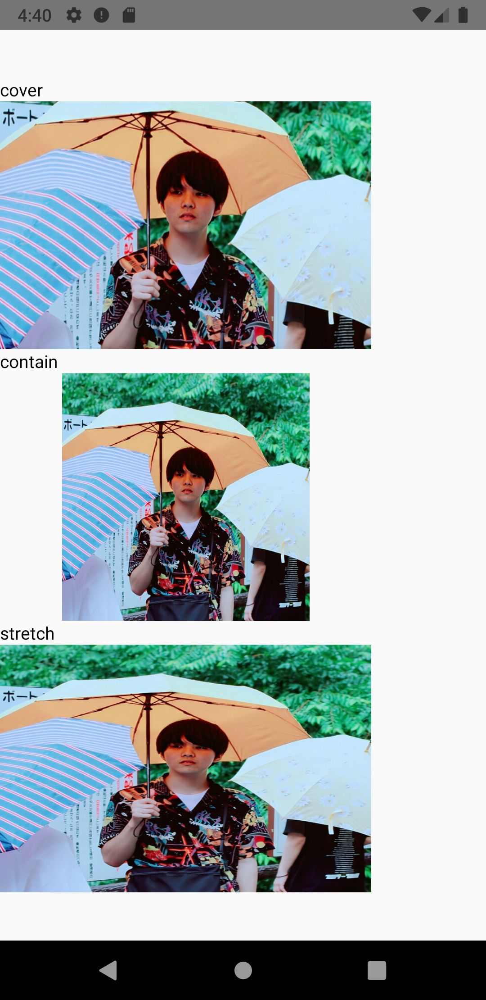

# React Nativeでの画像の表示
```js
import { Image } from 'react-native'
```

`Image`コンポーネントを使います。

## サーバにある画像は絶対パスで指定する
```js
<Image
  source={{ uri: 'https://xxx.xxx.xxx' }}
/>
```

## ローカルにある画像はrequireを使う
```js
<Image
  source={ require('./assets/xxx.png') }
/>
```

### requireを使うときの注意
`require()`に指定できるのは文字列のみなので、変数を代入したり、文字連結合したりするとエラーになります。

#### エラーサンプル
```js
const imagePath = './assets/xxx.png'
<Image
  source={ require(imagePath) }
/>
```

```js
const imageName = 'xxx'
<Image
  source={ require(`./assets/${ imageName }.png`) }
/>
```

## 画像の縦横比率の変更
### resizeModeプロパティを指定する

#### cover
- 縦横比は維持する
- width、heightの大きい数値に合わせて画像をリサイズする

#### contain
- 縦横比は維持する
- width、heightの小さい数値に合わせて画像をリサイズする

#### stretch
- 縦横比は維持しない
- width、heightの数値に合わせて画像をリサイズする

### デモ
```js
style={{ width: 300, height: 200 }}
```



# アイコンを表示しよう

## react-native-vector-icons
[github](https://github.com/oblador/react-native-vector-icons)

```
$ yarn add react-native-vector-icons
```

### iOS
```
cd ios/
$ pod install
```


`ios/[ PROJECT_NAME ]/Info.plist`に以下を追記する。

```js
<key>UIAppFonts</key>
<array>
  <string>AntDesign.ttf</string>
  <string>Entypo.ttf</string>
  <string>EvilIcons.ttf</string>
  <string>Feather.ttf</string>
  <string>FontAwesome.ttf</string>
  <string>FontAwesome5_Brands.ttf</string>
  <string>FontAwesome5_Regular.ttf</string>
  <string>FontAwesome5_Solid.ttf</string>
  <string>Foundation.ttf</string>
  <string>Ionicons.ttf</string>
  <string>MaterialIcons.ttf</string>
  <string>MaterialCommunityIcons.ttf</string>
  <string>SimpleLineIcons.ttf</string>
  <string>Octicons.ttf</string>
  <string>Zocial.ttf</string>
  <string>Fontisto.ttf</string>
</array>
```

Xcodeで`Info.plist`から手動で追加することもできる。  
+ボタンから`Fonts provided by application`でkeyを追加。  
追加したいフォント名を追加する。


### Android

`android/app/build.gradle`に以下を追記する。

```js
apply from: "../../node_modules/react-native-vector-icons/fonts.gradle"
```

## 演習
### Slackのプロフィールを模倣する

