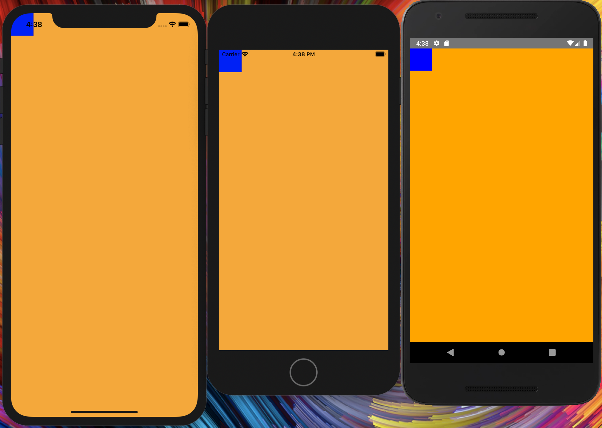
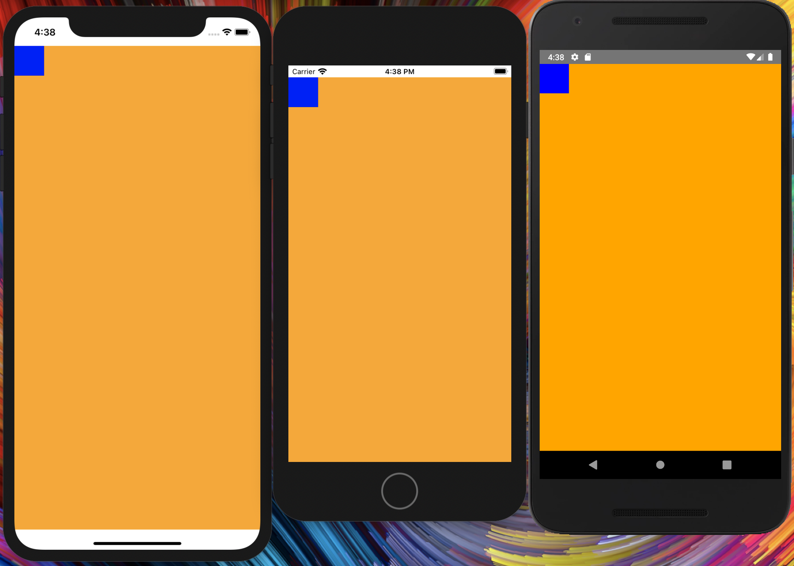
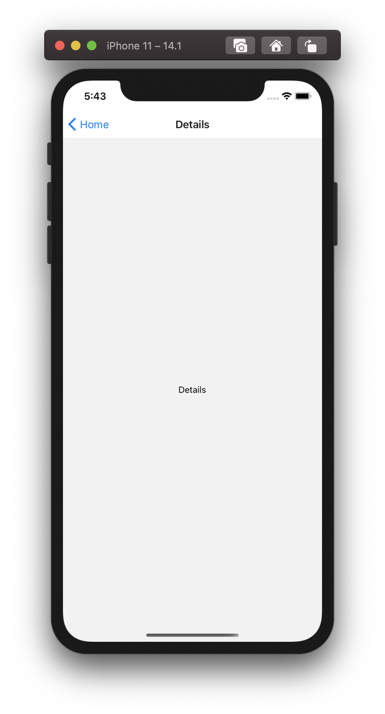

# イベントをつける
React.jsでは、`onClick`とかとか使っていたかと思います。（[他にも](https://ja.reactjs.org/docs/events.html)）
React Nativeでは`onPress`を使います。
React.jsの場合は、Dom要素に`onClick`を指定すればイベントを付与することができました。が、React Nativeでは`Button`と`Text`、`Pressable`コンポーネントのみにしかありません。
_※ v0.63から新しく[`Pressable`](https://reactnative.dev/docs/pressable)コンポーネントが追加されました。_
```js: title=OK
<Button onPress={ () => { console.log('hoge') } } title="button" />
<Text onPress={ () => { console.log('hoge') } }>button</Text>
```
```js: title=NG
<View onPress={ () => { console.log('hoge') } }>
  <Text>button</Text>
</View>
<Image
  onPress={ () => { console.log('hoge') } }
  ...
/>
```
### Button
[https://reactnative.dev/docs/button](https://reactnative.dev/docs/button)
### Text
[https://reactnative.dev/docs/text](https://reactnative.dev/docs/text)
### Pressable
[https://reactnative.dev/docs/pressable](https://reactnative.dev/docs/pressable)
## 他にもないの？
あります。
リストの親コンポーネントに`Button`は使いませんよね？`View`を使うと思います。
```js:title=こんな感じで
<View style={ styles.list }>
  <View style={ styles.listItem } onPress={ () => {} }>
    <Text>リスト1</Text>
  </View>
  <View onPress={ () => {} }>
    <Text>リスト2</Text>
  </View>
</View>
```
ただ、`View`コンポーネントにはonPressプロパティは存在しないので、いくらタップしてもイベントは発火しません。
そんな時、、、
React Nativeでは、`TouchableHighlight`や`TouchableOpacity`、`Touchablewithoutfeedback`コンポーネントが用意されている。用途に合わせて、それぞれのコンポーネントを使いわて使いましょう。
```js
<View style={ styles.list }>
  <TouchableOpacity style={ styles.listItem } onPress={ () => {} }>
    <Text>リスト1</Text>
  </TouchableOpacity>
  <TouchableOpacity onPress={ () => {} }>
    <Text>リスト2</Text>
  </TouchableOpacity>
</View>
```
## ViewでTouchableXxxxxを囲わなくても大丈夫なの？
TouchableOpacity、TouchableHighlight、Touchablewithoutfeedbackは、`Animated.View`でwrapされています。
```js:title=node_modules/react-native/Libraries/Components/Touchable/TouchableOpacity.js
// ...省略
  render(): React.Node {
    // BACKWARD-COMPATIBILITY: Focus and blur events were never supported before
    // adopting `Pressability`, so preserve that behavior.
    const {
      onBlur,
      onFocus,
      ...eventHandlersWithoutBlurAndFocus
    } = this.state.pressability.getEventHandlers();
    return (
      <Animated.View
        // ...省略
        />
      </Animated.View>
    );
  }
// ...省略
```
`Animated.View`を見てみると、
```js: title=node_modules/react-native/Libraries/Animated/src/components/AnimatedView.js
import * as React from 'react';
const View = require('../../../Components/View/View');
const createAnimatedComponent = require('../createAnimatedComponent');
import type {AnimatedComponentType} from '../createAnimatedComponent';
module.exports = (createAnimatedComponent(View): AnimatedComponentType<
  React.ElementConfig<typeof View>,
  React.ElementRef<typeof View>,
>);
```
わかりますね。Viewが使われてます。
なので、TouchableXxxxxはViewでwrapしなくても大丈夫です。
## 各TouchableXxxxxコンポーネントの特徴
### TouchableHighlight
[https://reactnative.dev/docs/touchablehighlight](https://reactnative.dev/docs/touchablehighlight)
- wrapされた要素が（タップ時）ハイライトされる
- ハイライトの詳細設定が可能（ドキュメント見てね）
### TouchableOpacity
[https://reactnative.dev/docs/touchableopacity](https://reactnative.dev/docs/touchableopacity)
- wrapされた要素が（タップ時）透過される
- 透過の詳細設定が可能（ドキュメント見てね）
### Touchablewithoutfeedback
[https://reactnative.dev/docs/touchablewithoutfeedback](https://reactnative.dev/docs/touchablewithoutfeedback)
- イベントの付与のみ
## TouchableXxxxxはonPressだけじゃない
`Button`コンポーネントは`onPress`しかプロパティを持ちません。
しかし、TouchableXxxxxは、`onPress`の他に、`onPressIn`タップされた時、`onPressOut`タップが外れた時にそれぞれ発火します。
## 発火される順番は？
`onPressIn`→`onPressOut`→`onPress`の順です。
## デバッグ方法は？
jsと同様`console.log`や`alert`を使うことで、logを出力することができる。


# ノッチ対応

2018年7月から、アップデートされるすべてのiOSアプリがノッチ対応を必須としなければならなくなりました。
React Nativeでは、`SafeAreaView`コンポーネントが用意されているのでSafeAreaViewを使い対応していきます。

## SafeAreaViewって？
SafeAreaViewはiOSバージョン11以降(iPhone X以降)のデバイスのみに適用され、Androidの場合は適応されません。
<!-- もしAndroidにも対応させたい場合は`Platform.OS`でOSの判定をする必要があります。
```js
const styles = StyleSheet.create({
  androidSafeAreaView: {
    …,
    paddingTop: Platform.OS === 'android' ? 25 : 0
  }
})
…
return (
  <SafeAreaView style={ styles.androidSafeAreaView }>
    …
  </SafeAreaView>
)
…
``` -->

iPhone11（14.1）、iPhone8（14.1）、Android端末で下記のレイアウトを確認してみましょう。

1. ノッチ対応なし

```js
…
return (
  <View style={{ backgroundColor: 'orange', flex: 1 }}>
    <View style={{ width: 50, height: 50, backgroundColor: 'blue' }} />
  </View>
)
…
```



2. ノッチ対応あり
```js
…
return (
  <SafeAreaView style={{ flex: 1 }}>
    <View style={{ backgroundColor: 'orange', flex: 1 }}>
      <View style={{ width: 50, height: 50, backgroundColor: 'blue' }} />
    </View>
  </SafeAreaView>
)
…
```



# 画面遷移（基礎編）

画面遷移には`react-navigation`を使用します。
<!-- 
## ナビゲーションの種類

### スタックナビゲーター

### タブナビゲーター -->

## 導入
```
yarn add @react-navigation/native @react-navigation/stack
yarn add react-native-reanimated react-native-gesture-handler react-native-screens react-native-safe-area-context @react-native-community/masked-view
```

```
cd ios
pod install
```
or
```
npx pod-install ios
```

<!-- TODO:CocoaPodsやGradleの軽い説明を挟む -->

## 画面遷移の準備

App.js
```js
import 'react-native-gesture-handler';
import * as React from 'react';
import { NavigationContainer } from '@react-navigation/native';

const App = () => {
  return (
    <NavigationContainer>
      {/* Rest of your app code */}
    </NavigationContainer>
  );
}
```

## スタックナビゲーターの実装

例として、`HomeScreen`と`DetailsScreen`を作成し、`HomeScreen`から`DetailsScreen`へ遷移できるようにします。

App.js
```js
import 'react-native-gesture-handler';
import * as React from 'react';
import { NavigationContainer } from '@react-navigation/native';
import { createStackNavigator } from '@react-navigation/stack';

const Stack = createStackNavigator();

const HomeScreen = ({ navigation }) => {
  return (
    <View style={{ flex: 1, justifyContent: 'center', alignItems: 'center' }}>
      <Text>Home</Text>
      <Button
        title="Go to Details"
        onPress={ () => navigation.navigate("Details") }
      />
    </View>
  )
}

const DetailsScreen = () => {
  return (
    <View style={{ flex: 1, justifyContent: 'center', alignItems: 'center' }}>
      <Text>Details</Text>
    </View>
  )
}

const App = () => {
  return (
    <NavigationContainer>
      <Stack.Navigator initialRouteName="Home">
        <Stack.Screen name="Home" component={HomeScreen} />
        <Stack.Screen name="Details" component={DetailsScreen} />
      </Stack.Navigator>
    </NavigationContainer>
  );
}
```


