# 画面遷移

画面遷移には`react-navigation`を使用します。

## ナビゲーションの種類

### スタックナビゲーション
元の画面の上に新しい画面が積み重なり、「戻る」という動作で新しい画面が取り除かれて元の画面に戻る形式

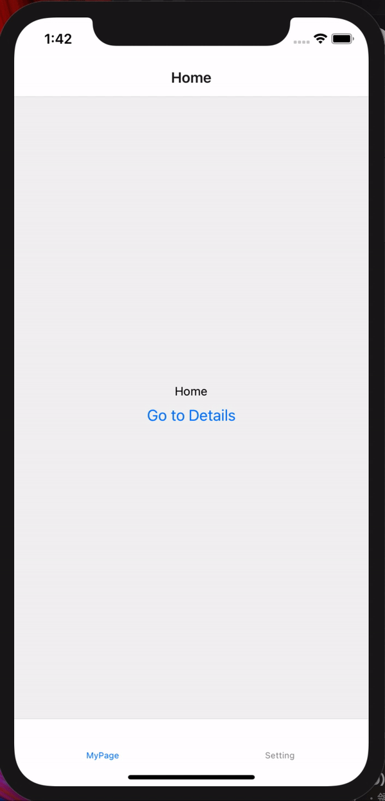

### タブナビゲーション
タブを使って画面を切り替える形式

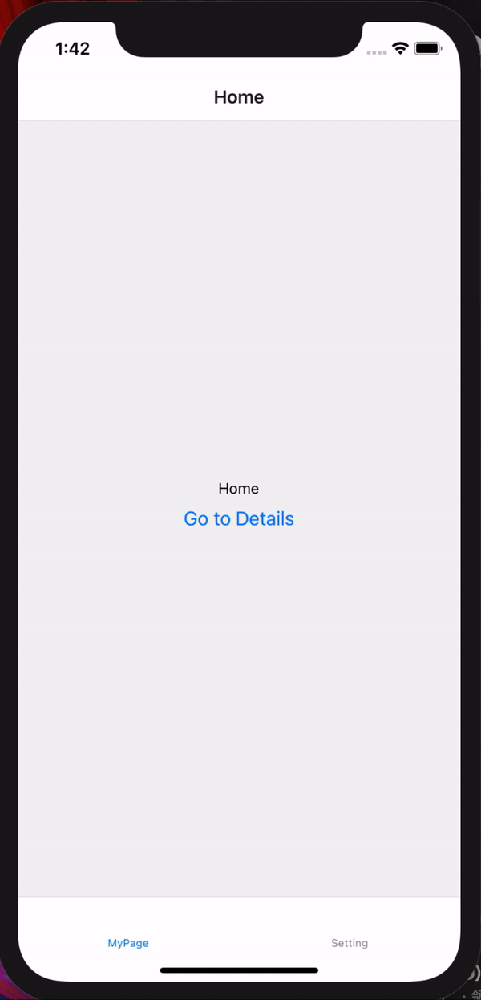

## 導入
```
yarn add @react-navigation/native @react-navigation/stack @react-navigation/bottom-tabs
yarn add react-native-reanimated react-native-gesture-handler react-native-screens react-native-safe-area-context @react-native-community/masked-view
```

```
cd ios
pod install
```
or
```
npx pod-install ios
```

<!-- TODO:CocoaPodsやGradleの軽い説明を挟む -->

## 画面遷移の準備

App.js
```js
import 'react-native-gesture-handler';
import React from 'react';
import { NavigationContainer } from '@react-navigation/native';

const App = () => {
  return (
    <NavigationContainer>
      {/* Rest of your app code */}
    </NavigationContainer>
  );
}
```

## スタックナビゲーションの実装

例として、`HomeScreen`と`DetailsScreen`を作成し、`HomeScreen`から`DetailsScreen`へ遷移できるようにします。

App.js
```js
import 'react-native-gesture-handler';
import React from 'react';
import { Button, View, Text } from 'react-native';
import { NavigationContainer } from '@react-navigation/native';
import { createStackNavigator } from '@react-navigation/stack';

const Stack = createStackNavigator();

const HomeScreen = ({ navigation }) => {
  return (
    <View style={{ flex: 1, justifyContent: 'center', alignItems: 'center' }}>
      <Text>Home</Text>
      <Button
        title="Go to Details"
        onPress={ () => navigation.navigate("Details") }
      />
    </View>
  )
}

const DetailsScreen = () => {
  return (
    <View style={{ flex: 1, justifyContent: 'center', alignItems: 'center' }}>
      <Text>Details</Text>
    </View>
  )
}

const App = () => {
  return (
    <NavigationContainer>
      <Stack.Navigator initialRouteName="Home">
        <Stack.Screen name="Home" component={HomeScreen} />
        <Stack.Screen name="Details" component={DetailsScreen} />
      </Stack.Navigator>
    </NavigationContainer>
  );
}
```

上記の`HomeScreen`のコンポーネントで示していますが、`props`には`navigation`が入っており、`navigation.navigate`によって画面遷移することができます。
```js
navigation.navigate('Screen Name')
```

### iOSとAndroidでの挙動  
<!-- 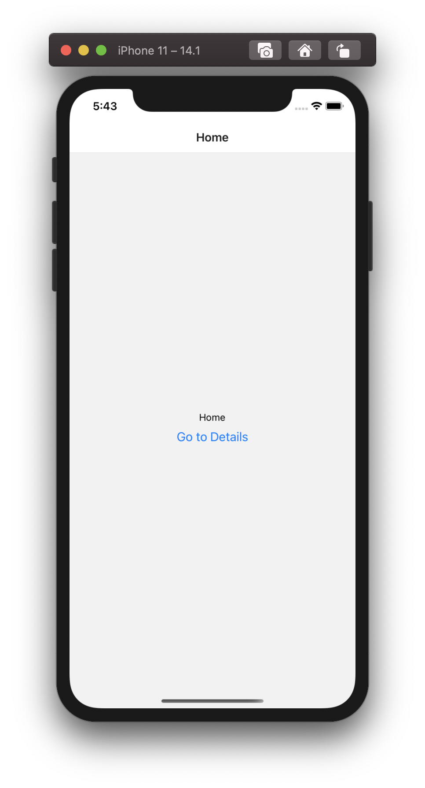 -->
<!-- 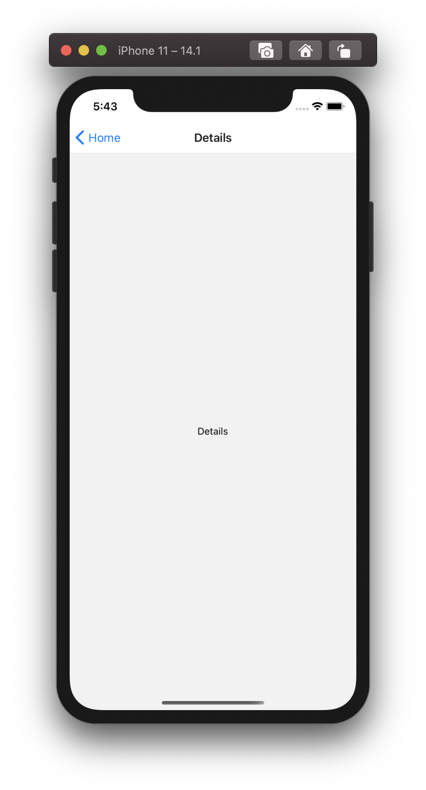 -->

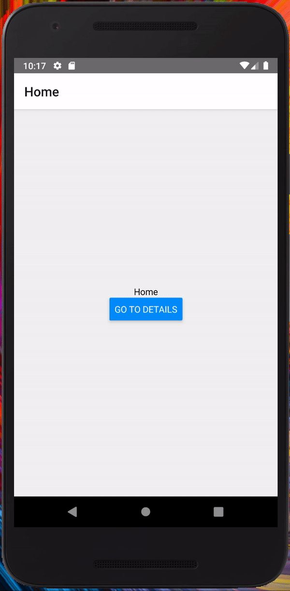

<!-- 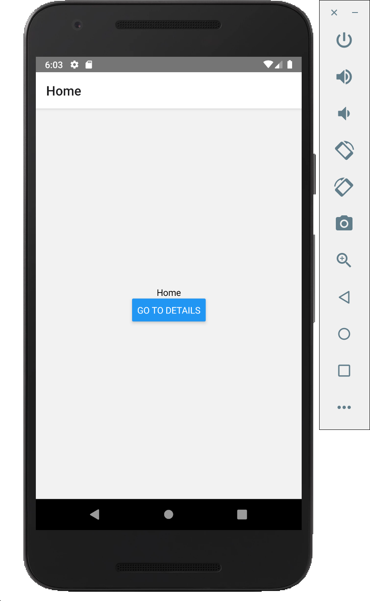
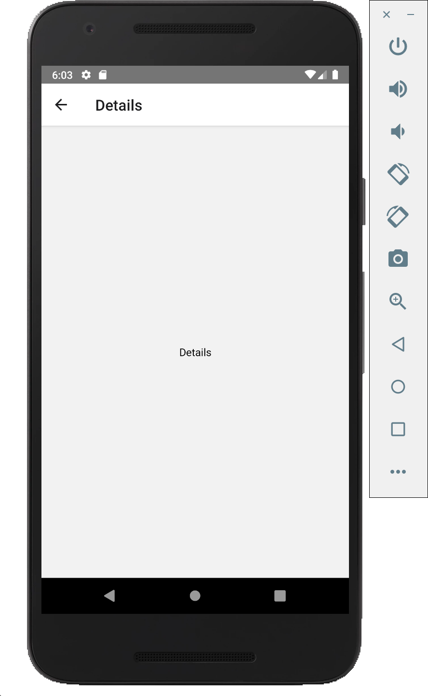 -->


## タブナビゲーションの実装
例として、`HomeScreen`と`SettingScreen`を作成し、それぞれタブで遷移できるようにします。

```js
import 'react-native-gesture-handler';
import React from 'react';
import { View, Text } from 'react-native';
import { NavigationContainer } from '@react-navigation/native';
import { createBottomTabNavigator } from '@react-navigation/bottom-tabs';

const Tab = createBottomTabNavigator();

const HomeScreen = () => {
  return (
    <View style={{ flex: 1, justifyContent: 'center', alignItems: 'center' }}>
      <Text>Home</Text>
    </View>
  )
}

const SettingScreen = () => {
  return (
    <View style={{ flex: 1, justifyContent: 'center', alignItems: 'center' }}>
      <Text>Setting</Text>
    </View>
  )
}

const App = () => {
  return (
    <NavigationContainer>
      <Tab.Navigator>
        <Tab.Screen name="Home" component={HomeScreen} />
        <Tab.Screen name="Details" component={SettingScreen} />
      </Tab.Navigator>
    </NavigationContainer>
  );
};
```

### iOSとAndroidでの挙動  

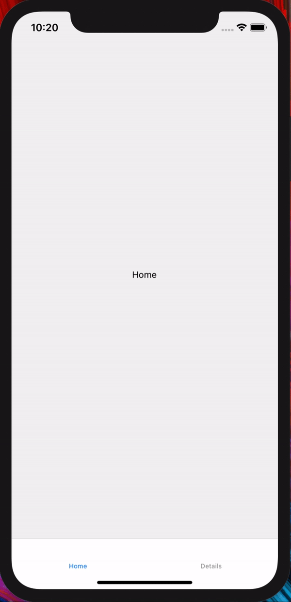
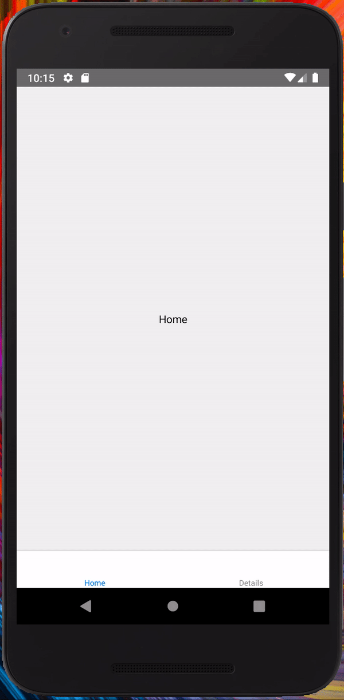

<!-- ### Android   -->

## ナビゲーションのネスト

`MyPage`、`Setting`タブを作成し、それぞれでスタックできるようにします。  
まず、`MyPage`タブ用のスタックナビゲーターを作成します。

```js
// HomeScreen、 DetailScreenは「スタックナビゲーションの実装」の例と同様
const MyPageStackScreen = () => {
  return (
    <Stack.Navigator initialRouteName="Home">
      <Stack.Screen name="Home" component={HomeScreen} />
      <Stack.Screen name="Details" component={DetailsScreen} />
    </Stack.Navigator>
  );
};
```
上記と同じようにSettingStackScreenを作成し、`Tab.Screen`の`component`に割り当てていきます。

App.js
```js
...
const App = () => {
  return (
    <NavigationContainer>
      <Tab.Navigator>
        <Tab.Screen name="MyPage" component={MyPageStackScreen} />
        <Tab.Screen name="Setting" component={SettingStackScreen} />
      </Tab.Navigator>
    </NavigationContainer>
  );
};
```


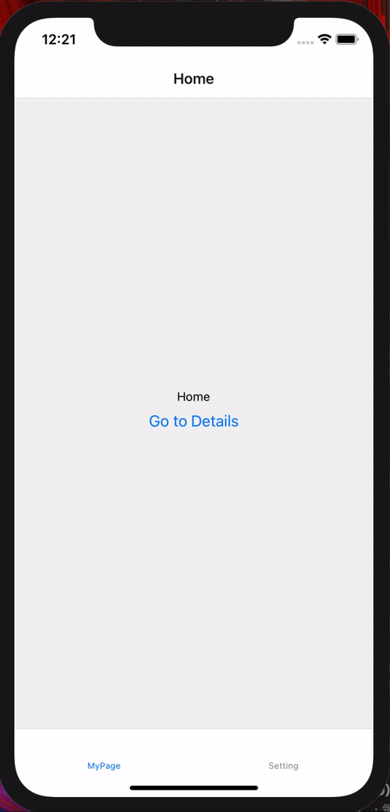

## 詳細の実装

`Stack`・`BottomTab`共にオプションを指定することができ、ラベルやアイコン、遷移アニメーションなどの詳細設定ができます。

### Stackのオプション例
* headerTitle
* headerLeft
* headerRight
* header
* headerShown
* animationEnabled
* cardStyleInterpolator
* gestureEnabled
* gestureDirection
* gestureResponseDistance
...

### Tabのオプション例
* tabBarLabel
* tabBarIcon
* tabBarButton
...

## パターン別の設計例

### タブの上にスクリーンを表示させたい

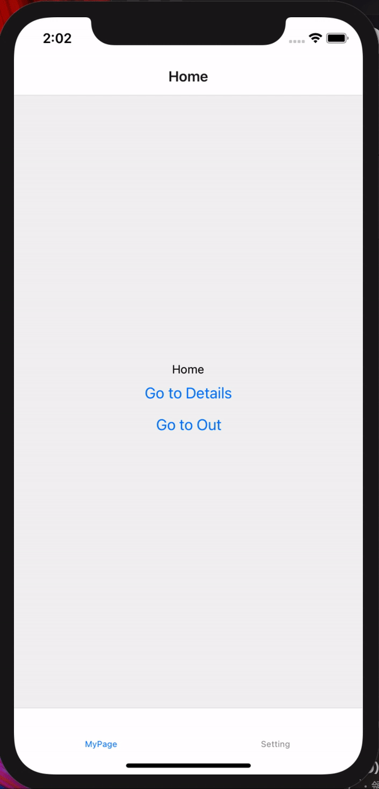
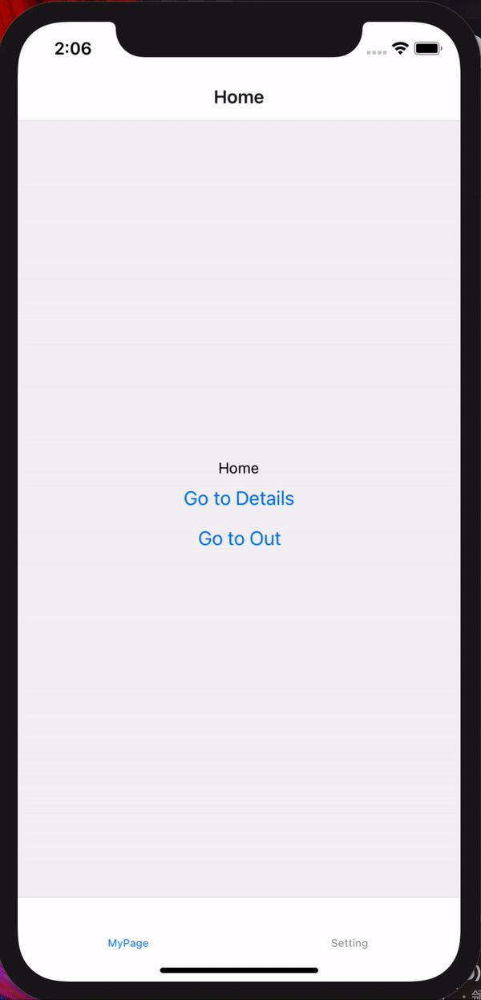

#### 水平方向の遷移
```js
// MainTabScreen: タブありスクリーン
// OutScreen: MainTabScreenの上に被せて表示させたいスクリーン

...
import { CardStyleInterpolators, createStackNavigator } from '@react-navigation/stack';

...
const App = () => {
  return (
    <NavigationContainer>
      <Stack.Navigator screenOptions={{ cardStyleInterpolator: CardStyleInterpolators.forHorizontalIOS }}>
        <Stack.Screen name="Main" component={MainTabScreen} options={{ headerShown: false }}/>
        <Stack.Screen name="Out" component={OutScreen}/>
      </Stack.Navigator>
    </NavigationContainer>
  );
};
```

#### 垂直方向の遷移

```js
...
const App = () => {
  return (
    <NavigationContainer>
      <Stack.Navigator mode="modal">
        <Stack.Screen name="Main" component={MainTabScreen} options={{ headerShown: false }}/>
        <Stack.Screen name="Out" component={OutScreen}/>
      </Stack.Navigator>
    </NavigationContainer>
  );
};
```


### 認証したい

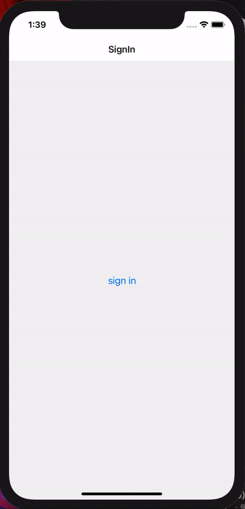

```js
// isSigned: 認証したかどうか
// SignInScreen: 未認証時に表示するスクリーン
// MainTabScreen: 認証後に表示するスクリーン
...
const App = () => {
  return (
    <NavigationContainer>
      <Stack.Navigator>
        { !isSigned
          ? <Stack.Screen name="SignIn" component={SignInScreen}/>
          : <Stack.Screen name="Main" component={MainTabScreen} options={{ headerShown: false }}/>
        }
      </Stack.Navigator>
    </NavigationContainer>
  );
};

```