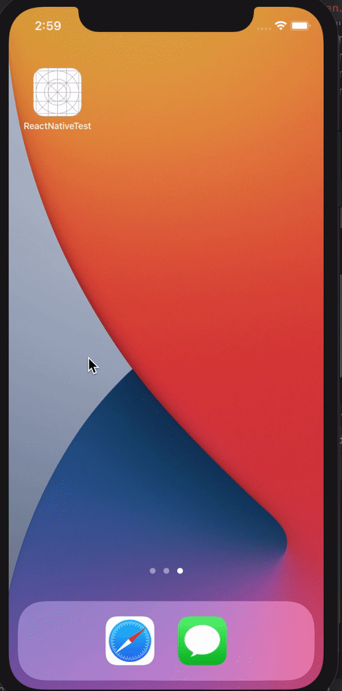
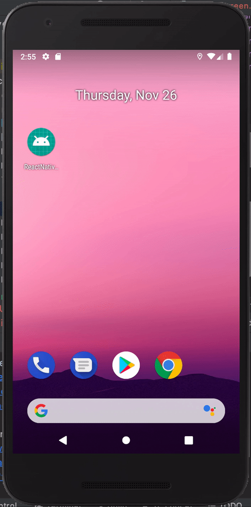
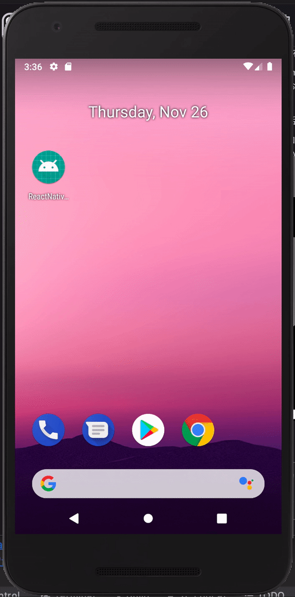
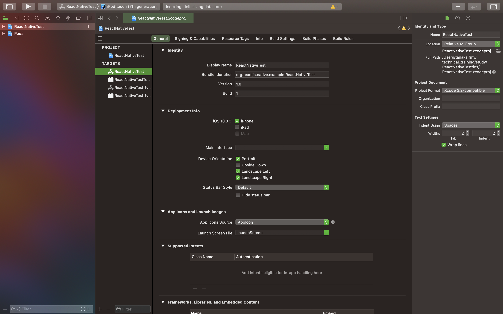
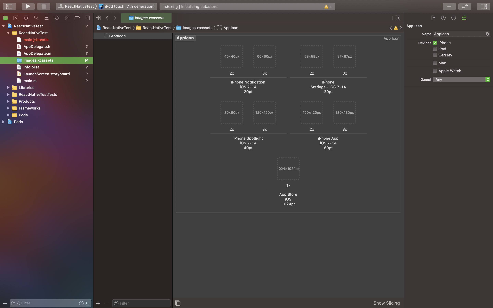

# スプラッシュ

<!-- デフォルトではAndroidのスプラッシュはないので、まずは実装していきます。 -->

<!-- 

[参考](https://medium.com/@appstud/add-a-splash-screen-to-a-react-native-app-810492e773f9)

今回は黒背景のスプラッシュ画面を作成します。

#### android/app/src/main/java/.../MainActivity.java

```java
import android.os.Bundle;
import org.devio.rn.splashscreen.SplashScreen;

public class MainActivity extends ReactActivity {
   @Override
    protected void onCreate(Bundle savedInstanceState) {
        SplashScreen.show(this);
        super.onCreate(savedInstanceState);
    }
}
```

#### android/app/src/main/res/layout/launch_screen.xml

```
<?xml version="1.0" encoding="utf-8"?>
<LinearLayout xmlns:android="http://schemas.android.com/apk/res/android"
    android:orientation="vertical" android:layout_width="match_parent"
    android:layout_height="match_parent"
    android:background="@drawable/splash_screen">
</LinearLayout>
```


スプラッシュスクリーン描画用xmlファイル
drawable/splash_screen.xml
```
<?xml version="1.0" encoding="utf-8"?>
<layer-list xmlns:android="http://schemas.android.com/apk/res/android">
    
    <item
        android:drawable="@color/splash_background"/>

</layer-list>
```

背景色の定義
color.xml
```
<?xml version="1.0" encoding="utf-8"?>
<resources>
  ...
    <color name="splash_background">#000000</color>
</resources>
```


これでスプラッシュの実装ができました。
ただ、このままでは起動直後に


スプラッシュスクリーンアクティビティのテーマの定義
values/styles.xml
```
...
    <style name="SplashTheme" parent="Theme.AppCompat.Light.NoActionBar">
        <item name="android:background">@drawable/splash_screen</item>
    </style>
```

スプラッシュアクティビティの作成
SplashActivity.java
```java
package [パッケージ名]; // 書き方は他Activityを参考にしてください。

import android.content.Intent;
import android.os.Bundle;
import androidx.appcompat.app.AppCompatActivity;

public class SplashActivity extends AppCompatActivity {
    @Override
    protected void onCreate(Bundle savedInstanceState) {
        super.onCreate(savedInstanceState);

        Intent intent = new Intent(this, MainActivity.class);
        startActivity(intent);
        finish();
    }
}
```
AndroidManifest.xml

```
...
    <application>
        <activity
          android:name=".SplashActivity"
          android:theme="@style/SplashTheme"
          android:label="@string/app_name">
          <intent-filter>
              <action android:name="android.intent.action.MAIN" />
              <category android:name="android.intent.category.LAUNCHER" />
          </intent-filter>
        </activity>
        <activity
          android:name=".MainActivity"
          android:label="@string/app_name"
          android:configChanges="keyboard|keyboardHidden|orientation|screenSize"
          android:windowSoftInputMode="adjustResize"
          android:exported="true"/>

      <activity android:name="com.facebook.react.devsupport.DevSettingsActivity" />
    </application>
``` -->


<!-- ## 制御

#### android/app/src/main/java/.../MainActivity.java

```java
import android.os.Bundle;
import org.devio.rn.splashscreen.SplashScreen;

public class MainActivity extends ReactActivity {
   @Override
    protected void onCreate(Bundle savedInstanceState) {
        SplashScreen.show(this);
        super.onCreate(savedInstanceState);
    }
}
```

#### android/app/src/main/res/layout/launch_screen.xml

```
<?xml version="1.0" encoding="utf-8"?>
<LinearLayout xmlns:android="http://schemas.android.com/apk/res/android"
    android:orientation="vertical" android:layout_width="match_parent"
    android:layout_height="match_parent"
    android:background="@drawable/splash_screen">
</LinearLayout>
``` -->


スプラッシュ画面とはアプリ起動直後の画面のことです。


アプリ内で必要なデータの取得など、アプリの準備作業をスプラッシュ画面の裏側で行うことで、UXの向上を図ることができます。


react nativeではプロジェクト作成時からiOS側では実装されていて、Android側では実装されていないので、Android側でのスプラッシュ画面の実装が必要となります。


また、iOSのスプラッシュ画面もただ表示しているだけで、制御する必要があります。

スプラッシュの制御には`react-native-splash-screen`を使用します。

ネイティブ側でスプラッシュの表示をし、JS側では任意のタイミングで非表示にするようにします。


## 導入
```
yarn add react-native-splash-screen
```

```
cd ios
pod install
```
or
```
npx pod-install ios
```

## スプラッシュの実装・制御

今回は青背景のスプラッシュ画面を作成します。

### iOS

スプラッシュ画面のファイルは `ios/[プロジェクト名]/LaunchScreen.storyboard` です。
デフォルトでは文字が表示されているので、不要部分を削除し、背景色を変更します。

```
...
<!--View Controller-->
<scene sceneID="EHf-IW-A2E">
    <objects>
        <viewController id="01J-lp-oVM" sceneMemberID="viewController">
            <view key="view" contentMode="scaleToFill" id="Ze5-6b-2t3">
                <!-- subviews、constraintsの削除 -->
                <rect key="frame" x="0.0" y="0.0" width="375" height="667"/>
                <autoresizingMask key="autoresizingMask" widthSizable="YES" heightSizable="YES"/>
                <viewLayoutGuide key="safeArea" id="Bcu-3y-fUS"/>
                <!-- backgroundColorの変更 -->
                <color key="backgroundColor" red="0" green="0" blue="1" alpha="1" colorSpace="custom" customColorSpace="sRGB"/>
            </view>
        </viewController>
        <placeholder placeholderIdentifier="IBFirstResponder" id="iYj-Kq-Ea1" userLabel="First Responder" sceneMemberID="firstResponder"/>
    </objects>
    <point key="canvasLocation" x="52.173913043478265" y="375"/>
</scene>
```


次に、スプラッシュ画面の制御をしていきます。  
アプリケーションの起動や終了や中断などの処理を記載している `ios/[ProjectName]/AppDelegate.m` に下記のように追加します。

```m
...
#import "RNSplashScreen.h" // add

@implementation AppDelegate

- (BOOL)application:(UIApplication *)application didFinishLaunchingWithOptions:(NSDictionary *)launchOptions
{
    ...
    [RNSplashScreen show]; // add
    return YES;
}

@end
```

### Android
[Androidのリソース](https://developer.android.com/guide/topics/resources/providing-resources?hl=ja)は`android/app/src/main/res/`配下に配置する必要があり、リソースタイプ別に固有のディレクトリ名が必要となります。

|||
|-|-|
|mipmap/| ランチャーアイコン（ホーム画面に表示されるアイコン）|
|values/|文字列、整数、色などの定義<br>colors.xml: 色の値の定義用<br>strings.xml: 文字列の値の定義用<br>styles.xml: スタイルの定義用
|drawable/|画面上に描画するグラフィック| 
|layout/|レイアウト定義用|

まず、`android/app/src/main/java/.../MainActivity.java` に下記のように追加します。

```java
import android.os.Bundle; // add
import org.devio.rn.splashscreen.SplashScreen; // add

public class MainActivity extends ReactActivity {
   @Override
    protected void onCreate(Bundle savedInstanceState) {
        SplashScreen.show(this);
        super.onCreate(savedInstanceState);
    }
}
```

スプラッシュ画面のレイアウトを定義するファイル `res/layout/launch_screen.xml` を作成します。

```
<?xml version="1.0" encoding="utf-8"?>
<LinearLayout xmlns:android="http://schemas.android.com/apk/res/android"
    android:orientation="vertical" android:layout_width="match_parent"
    android:layout_height="match_parent"
    android:background="@drawable/splash_screen">
</LinearLayout>
```

スプラッシュ画面を描画するためのファイル`res/drawable/splash_screen.xml` を作成します。
```
<?xml version="1.0" encoding="utf-8"?>
<layer-list xmlns:android="http://schemas.android.com/apk/res/android">
    
    <item
        android:drawable="@color/splash_background"/>

</layer-list>
```

<!--
```
<?xml version="1.0" encoding="utf-8"?>
<LinearLayout xmlns:android="http://schemas.android.com/apk/res/android"
    android:orientation="vertical" android:layout_width="match_parent"
    android:layout_height="match_parent"
    android:background="@drawable/splash_screen">
</LinearLayout>
```

スプラッシュスクリーン描画用xmlファイル
drawable/splash_screen.xml
```
<?xml version="1.0" encoding="utf-8"?>
<layer-list xmlns:android="http://schemas.android.com/apk/res/android">
    
    <item
        android:drawable="@color/splash_background"/>

</layer-list>
``` -->

最後に、`res/values/color.xml` に背景色の定義をします。
```
<?xml version="1.0" encoding="utf-8"?>
<resources>
  ...
    <color name="splash_background">#0000FF</color>
</resources>
```


### JS
AndroidとiOSでスプラッシュの表示ができたら、次はJS
側で任意のタイミングで非表示にします。

```js
import SplashScreen from 'react-native-splash-screen'

// 非表示したい箇所で下記を記述
SplashScreen.hide();

// 一定時間経過後に非表示にする場合
setTimeout(() => {
  SplashScreen.hide();
}, 3000)
```



Androidのスプラッシュ画面ですが、起動直後には表示されていないのが確認できます。


Androidでも起動直後から表示されるよう実装していきます。

### Androidで起動直後にスプラッシュを出す

[参考ページ](https://medium.com/@appstud/add-a-splash-screen-to-a-react-native-app-810492e773f9)


スプラッシュ用のアクティビティ `android/app/src/main/java/.../SplashActivity.java`  を作成します。

```java
package [パッケージ名]; // 書き方は他Activityを参考にしてください。

import android.content.Intent;
import android.os.Bundle;
import androidx.appcompat.app.AppCompatActivity;

public class SplashActivity extends AppCompatActivity {
    @Override
    protected void onCreate(Bundle savedInstanceState) {
        super.onCreate(savedInstanceState);

        Intent intent = new Intent(this, MainActivity.class);
        startActivity(intent);
        finish();
    }
}
```

`SplashActivity` 用のテーマの定義を `values/styles.xml` に記述します。
```
...
    <style name="SplashTheme" parent="Theme.AppCompat.Light.NoActionBar">
        <item name="android:background">@drawable/splash_screen</item>
    </style>
```

アプリの基本的な情報が書かれているファイル `AndroidManifest.xml` に `SplashActivity` を追加します。

```
...
<application>

    <!-- SplashActivityの追加、MainActivityのintent-filterを移動 -->
    <activity
      android:name=".SplashActivity"
      android:theme="@style/SplashTheme"
      android:label="@string/app_name">
      <intent-filter>
          <action android:name="android.intent.action.MAIN" />
          <category android:name="android.intent.category.LAUNCHER" />
      </intent-filter>
    </activity>

    <!-- intent-filterの削除、`android:exported="true"`パラメータの追加 -->
    <activity
      android:name=".MainActivity"
      android:label="@string/app_name"
      android:configChanges="keyboard|keyboardHidden|orientation|screenSize"
      android:windowSoftInputMode="adjustResize"
      android:exported="true"/>

  <activity android:name="com.facebook.react.devsupport.DevSettingsActivity" />
</application>
```



# アイコン

iOS/Androidともに、様々なサイズのリソースを設定する必要があります。
今回はサイズ別にアイコンが全て用意されている前提で進めていきます。

## iOS
Xcode上で設定していきます。

ターゲット設定の `General > App Icons and Launch Images > App Icons Source` を編集します（右の矢印をクリック）



素材を各サイズに合わせてドラッグすることで、アイコンの設定は完了します。




## Android

### [画面ピクセル密度（dpi）](https://developer.android.com/training/multiscreen/screendensities?hl=ja)

Androidデバイスは、画面サイズだけでなく、画面のピクセルサイズも様々あります。
そのため、各デバイスのピクセルの密度に合わせたリソースを使用する必要があります。
密度によって下記のようなグループ分けがされます。

|||
|-|-|
|ldpi|低密度画面|
|mdpi|中密度画面|
|hdpi|高密度画面|
|xhdpi|超高密度画面|
|xxhdpi|超超高密度画面|
|xxxhdpi|超超超高密度画面|

リソースの使い分けをするためには、下記のように各グループごとに`mipmap/`ディレクトリを用意し、その中に対応するリソースを格納していきます。
Androidではプロジェクト作成時にデフォルトアイコンが設定されています。

```
mipmap-xxxhdpi/
  ic_launcher.png
  ic_launcher_round.png
mipmap-xxhdpi/
  ic_launcher.png
  ic_launcher_round.png
mipmap-xhdpi/
  ic_launcher.png
  ic_launcher_round.png
mipmap-hdpi/
  ic_launcher.png
  ic_launcher_round.png
mipmap-mdpi/
  ic_launcher.png
  ic_launcher_round.png
```


### [アダプティブ アイコン](https://developer.android.com/guide/practices/ui_guidelines/icon_design_adaptive?hl=ja)
Android 8.0（API レベル 26）から、アダプティブ ランチャー アイコンが導入され、デバイスモデルごとに異なる図形を表示できるようになりました。
アダプティブアイコンに対応した実装をしていきます。

`ic_launcher_foreground.png` と `ic_launcher_background.png`がdpi別に用意されている場合、同じように各ディレクトリに格納しておきます。

`res/mipmap-anydpi-v26/ic_launcher.xml`を作成します。

```
<?xml version="1.0" encoding="utf-8"?>
<adaptive-icon xmlns:android="http://schemas.android.com/apk/res/android">
    <background android:drawable="@mipmap/ic_launcher_background" />
    <foreground android:drawable="@mipmap/ic_launcher_foreground" />
</adaptive-icon>
```

今回の場合のアイコン周りのディレクトリ構成は下記のようになります。

```
mipmap-anydpi-v26/
  ic_launcher.xml
mipmap-xxxhdpi/
  ic_launcher.png
  ic_launcher_round.png
  ic_launcher_foreground.png
  ic_launcher_background.png
mipmap-xxhdpi/
  ic_launcher.png
  ic_launcher_round.png
  ic_launcher_foreground.png
  ic_launcher_background.png
mipmap-xhdpi/
  ic_launcher.png
  ic_launcher_round.png
  ic_launcher_foreground.png
  ic_launcher_background.png
mipmap-hdpi/
  ic_launcher.png
  ic_launcher_round.png
  ic_launcher_foreground.png
  ic_launcher_background.png
mipmap-mdpi/
  ic_launcher.png
  ic_launcher_round.png
  ic_launcher_foreground.png
  ic_launcher_background.png
```