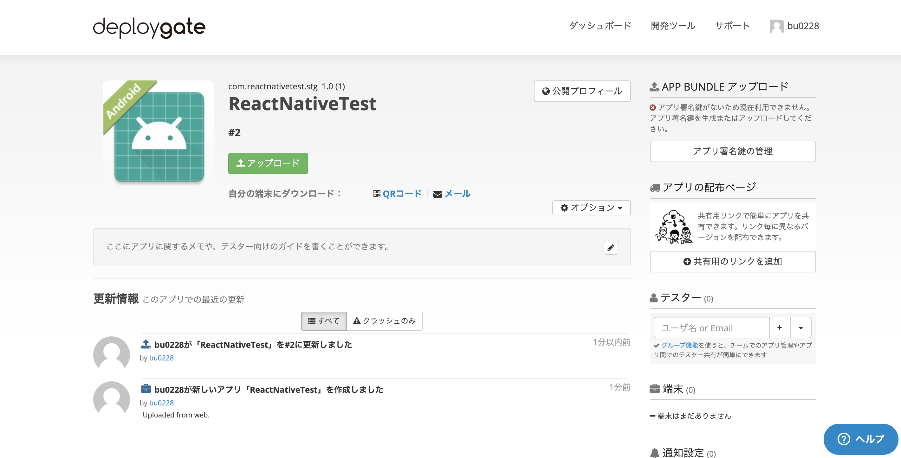
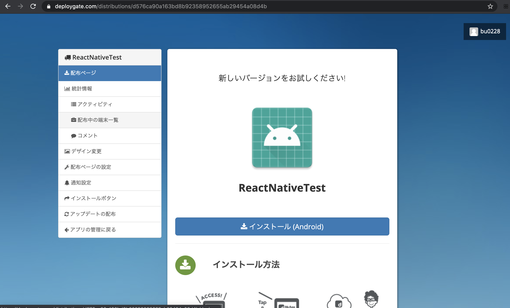
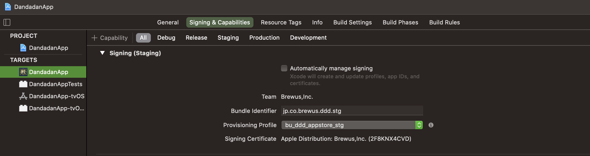
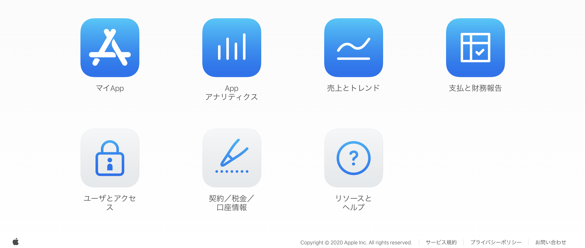
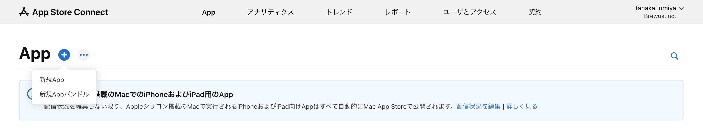
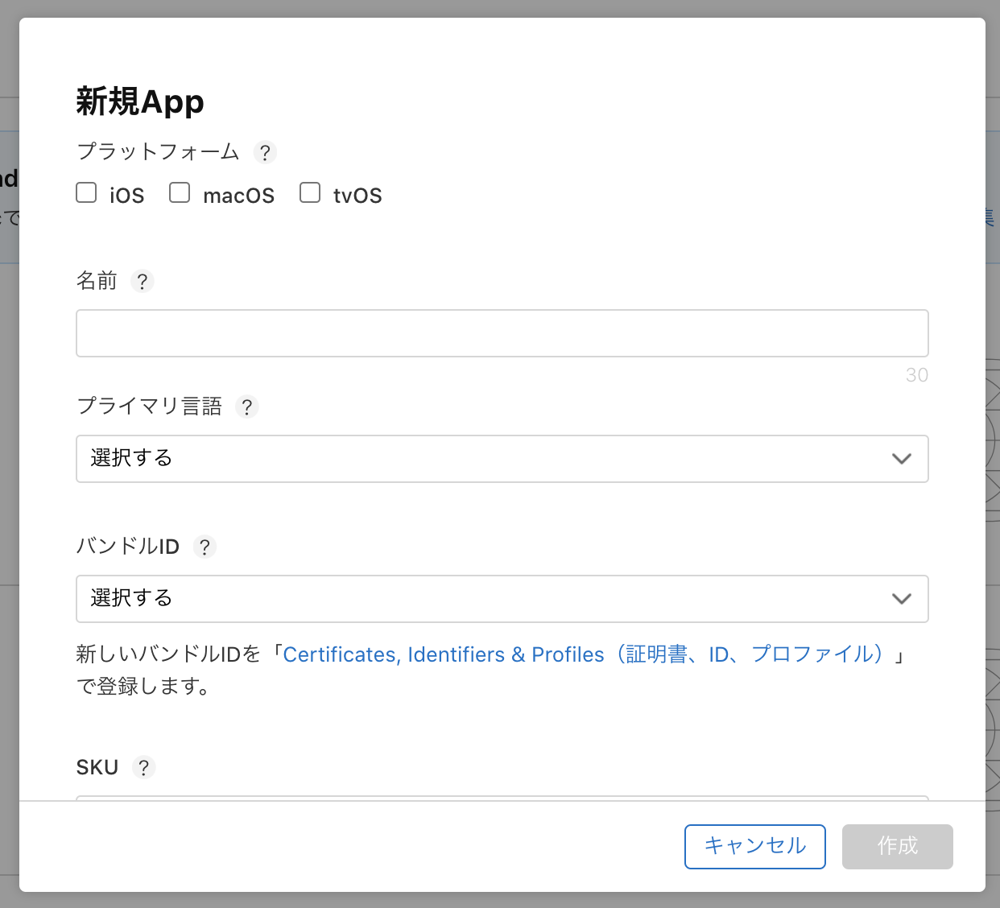
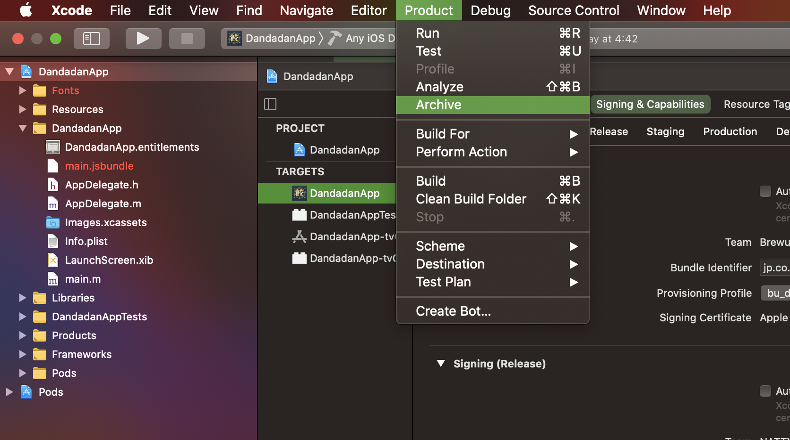
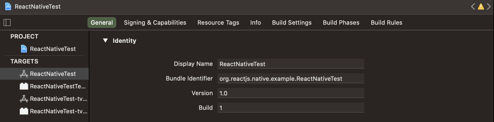

# アプリの共有

作成したアプリを共有するための方法です。

AndroidアプリをDeploygate、iOSアプリをTestFlightを用いて共有しています。

## Deploygate

### [Gradle DeployGate Plugin](https://github.com/DeployGate/gradle-deploygate-plugin/blob/master/README_JP.md) の導入

android/build.gradle
```
buildscript {
    …
    repositories {
        …
        jcenter()
    }
    dependencies {
        …
        classpath 'com.deploygate:gradle:2.3.0'
    }
}
```

android/app/build.gradle
```
apply plugin: 'com.android.application'
apply plugin: 'deploygate'
…

android {
  …
  deploygate {
    appOwnerName = '……………'
    apiToken = '……………'
  }
}

```

### アップロード

staging環境の場合の例
```
$ cd android
$ ENVFILE=../.env.stg ./gradlew clean uploadDeployGateStaging
```

また、Deploygateにapkファイルを直接アップロードすることもできます。


### 配布ページの作成

アプリのアップロード後、共有用の配布ページを作成します。

アプリ詳細画面に遷移し、`共有用のリンクの追加`を選択すると、共有用のページが作成されます。



配布ページ下部に表示されているQRコードやURLを共有することで、アプリの配布ができます。



また、配布ページ内の`配布ページの設定`に遷移することで、配布ページの無効化や公開範囲の設定ができます。

### 配布ページの更新

配布ページ作成後にビルドを更新する際、このままの設定では配布ページ上のビルドは更新されないので、android/app/build.gradle に追記する必要があります。

```
android {
  …
  deploygate {
    …
    deployments {
      staging {
        distribution {
          key = "……………"
        }
      }
    }
  }
}
```

keyには配布ページのURLの後ろに付いている文字列（今回の場合はd576ca90a163bd8b92358952655ab29454a08d4b）を設定します。


## TestFlight

[アプリ申請のためXcodeでアップロードする](https://i-app-tec.com/ios/app-upload.html)

### ビルドの準備

[証明書周りのまとめ](https://shigu493.com/%E3%80%90ios%E3%80%91%E8%A4%87%E9%9B%91%E3%81%AA%E8%A8%BC%E6%98%8E%E6%9B%B8%E5%91%A8%E3%82%8A%E3%82%92%E3%81%82%E3%81%A3%E3%81%95%E3%82%8A%E6%95%B4%E7%90%86/)


#### 証明書の取得

https://developer.apple.com/account/resources/certificates/list

#### IDの登録

https://developer.apple.com/account/resources/identifiers/list

#### Provisioning Profileの作成

https://developer.apple.com/account/resources/profiles/list

作成したProvisioning ProfileはXcodeのTargets > Signing&Capabilitiesから対象のビルド環境へ反映します。



### App Store Connectへのアプリの登録

<!-- App Store Connectにアプリを作成します。 -->

App Store Connectにログイン後、`マイApp`を選択します。



左上の`App`の右にある`+`ボタンから`新規 App`を選択します。





アップロードしたいアプリ用のバンドルIDを選択します。


### 内部テスターへの共有
内部テスターとして追加したいアカウントを[ユーザとアクセス](https://appstoreconnect.apple.com/access/users)で作成しておき、共有したいアプリをアクセス可能にしておきます。

その後、`内部グループ`の`App Store Connectユーザ`を選択し、アプリを共有したいユーザをテスターに追加していきます。


### アプリのビルド

Xcodeを起動し、上部メニューの`Product` > `Archive`を選択します。



ビルドに成功すると、`Organizer`という名前のウィンドウが自動的に表示されます。

### アプリのアップロード
`Organizer`ウィンドウ（上部メニューの Window > Organizer でも表示可能）で、アップロードしたいアプリを選択し、`Validate App`を選びます。

いくつか確認事項が出てきますので指示に沿って進めます。

最後に`Validate`ボタンを選択し、完了すると完了画面が表示されます。

次に、`Distribute App`を選びます。

こちらも同様にいくつか確認事項が出てきますので指示に沿って進めます。

最後に`Upload`ボタンを選択し、完了すると完了画面が表示されます。

これでXcode上でのApp Store Connectへのアップロード作業は完了です。

### アプリの共有準備

App Store Connectにアップロードされていることを確認します。
アップロード直後は`処理中`というステータスですが、しばらくするとステータスが更新されます。

`提出準備完了`というステータスになれば、あとはテスターに共有するだけです。

`輸出コンプライアンスがありません`というステータスであれば、別途対応が必要です。

[輸出コンプライアンスの概要](https://help.apple.com/app-store-connect/#/dev88f5c7bf9)
[「輸出コンプライアンスがありません」と表示しない方法](https://tommy10344.hatenablog.com/entry/2020/04/29/025809)

## ビルドの更新

ビルドの更新をする際、ビルドバージョンを変更する必要があります。

### Android

android/app/build.gradle
```
android {
  …
  defaultConfig {
    …
    versionCode 1
    …
  }
  …
}
```

### iOS

TARGETS > [ PROJECT_NAME ] > General > Identify > Build



